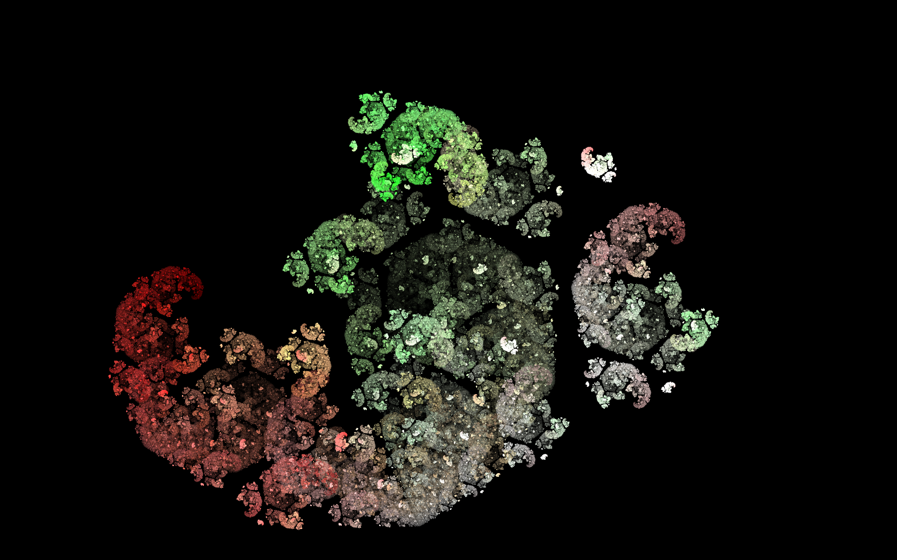
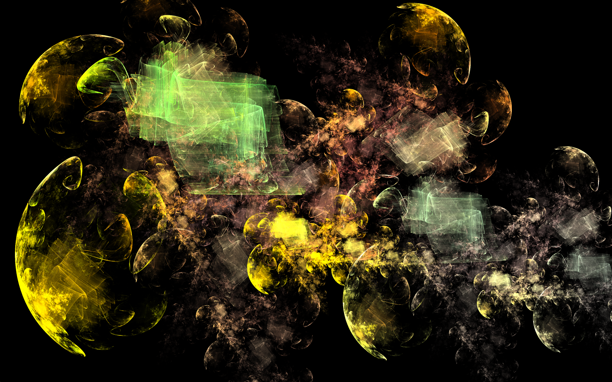

# FractalsInNet

This is a 'fork' of http://fractron9000.sourceforge.net/ by 2010 Michael J. Thiesen

I couldn't run the original source code on my computer, so I simply updated the project references and tweaked a few lines of code.

## Samples

